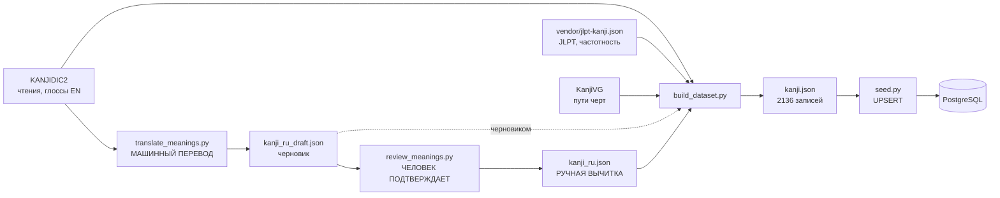

# Как собирается справочник кандзи

Документ описывает, откуда берутся данные об иероглифах, как они
превращаются в содержимое базы и что нужно сделать, чтобы добавить новый
знак в уроки.

## Коротко

В базе лежат все **2136** иероглифов дзёё, но пользователю показывается
только тот, у кого русское значение выверено человеком. Автоматика заполняет
всё, что можно взять из справочников надёжно (чтения, ромадзи, число черт,
JLPT, частотность, пути черт), и отдельно готовит **черновик перевода**
значений — но не публикует его. Значение попадает в уроки только после того,
как его подтвердил человек.

## Поток данных



Сплошная стрелка от `kanji_ru.json` — это то, что видит пользователь.
Пунктирная от черновика — поле `meaning_suggested_ru`, которое наружу не
отдаётся никогда.

Внешние источники скачиваются в `backend/data/raw/` — этот каталог в
репозиторий не коммитится (десятки мегабайт).

## Три файла, которые легко перепутать

| | `kanji_ru.json` | `kanji_ru_draft.json` | `kanji.json` |
|---|---|---|---|
| Что это | **вход**, пишется руками | **вход**, пишет модель | **выход**, генерируется |
| Кто пишет | человек, через `review_meanings.py` | `translate_meanings.py` | `build_dataset.py` |
| Размер | ~64 КБ, 81 запись | до ~2 МБ, до 2055 записей | ~5,7 МБ, 2136 записей |
| Влияет на `is_published` | **да, только он** | нет | нет |
| При пересборке | не трогается | не трогается | **перезаписывается целиком** |

Разделение принципиальное. `build_dataset.py` делает
`OUT_FILE.write_text(...)`, то есть затирает `kanji.json` полностью. Живи
русский текст только там, следующий запуск скрипта его уничтожил бы.

Второй довод — ревью: правку в файле вычитки видно построчно, диff
сгенерированного файла на 5,7 МБ прочитать невозможно.

`kanji.json` коммитится намеренно: так `seed` работает без сети и
детерминированно, а деплой не зависит от доступности edrdg.org и GitHub.
Цена — сгенерированный файл в истории.

## Источники

Полный список с лицензиями и перечнем внесённых изменений — в
[ATTRIBUTION.md](../ATTRIBUTION.md) и в `GET /api/sources`. Оба собираются из
`backend/app/sources.py`, править нужно его.

| Источник | Что даёт | Покрытие |
|---|---|---|
| KANJIDIC2 | чтения он/кун, английские глоссы | 2136 из 2136 |
| `data/vendor/jlpt-kanji.json` | уровень JLPT, частотность, радикал, число черт | 2136 |
| KanjiVG, релиз `r20250816` | пути черт | 2136 из 2136 |
| `kanji_ru.json` | значение, описание порядка черт, слова-примеры | 81 |

Русского значения **самих иероглифов** нет ни в одном источнике. В KANJIDIC2
значения только на английском, испанском и французском.

Два источника закреплены в репозитории или по версии намеренно:

* `jlpt-kanji.json` лежит в `data/vendor/` (вместе с текстом лицензии MIT),
  потому что репозиторий-источник личный и может исчезнуть в любой момент, а
  без него сборка не поднимется.
* KanjiVG качается по версии релиза, а не с `master`. Незакреплённая ссылка
  означала бы, что пересборка через полгода молча меняет прописи у уже
  опубликованных знаков.

У KANJIDIC2 версий нет — файл на edrdg.org обновляется на месте.

## Что делает `build_dataset.py`

```bash
docker compose -f docker-compose.yml -f docker-compose.dev.yml run --rm backend \
  python -m scripts.build_dataset
```

1. Скачивает источники в `raw/` (если их там ещё нет) и разбирает.
2. Сортирует 2136 знаков по возрастанию частотности и присваивает
   `order_index` — это порядок курса: чем употребительнее знак, тем
   раньше его изучают.
3. Собирает надёжные поля из KANJIDIC2 и `jlpt-kanji.json`.
4. Определяет пару «кана + ромадзи» для каждого вида чтения (см. ниже).
5. Кладёт машинный перевод из черновика в `meaning_suggested_ru` — **не** в
   `meaning`.
6. Берёт `meaning`, `writing_note`, `example_words` из `kanji_ru.json`, если
   знак там есть.
7. Прикладывает пути черт из KanjiVG, пересчитав координаты из сетки 109×109
   в 0..100.
8. Проставляет флаги: `is_published = bool(meaning)`,
   `needs_review = есть перевод, но нет вычитки`.

Флага `--with-strokes` больше нет. Раньше он существовал, потому что черты
качались отдельным запросом на каждый знак; теперь весь KanjiVG приходит одним
файлом на 3,4 МБ, и смысла в флаге не осталось. Заодно ушли грабли: `seed`
перезаписывает поле `strokes`, поэтому забытый флаг стирал прописи в базе.

## Чтения: кана и ромадзи

Кана берётся из `kanji_ru.json`, если там задана, иначе первая из KANJIDIC2.
Ромадзи считается **из этой же каны** модулем `scripts/romaji.py`, если в
вычитке не задано своё. Пара не может разойтись по построению.

Это не теоретическая предосторожность. Пока поля для каны в файле вычитки не
было, 14 из 160 опубликованных пар противоречили сами себе: у 木 показывалась
ボク с подписью «moku», хотя ボク читается «boku» — человек имел в виду モク,
но записать это было негде. Для приложения, которое учит читать кану, это
ровно та ошибка, которую допускать нельзя.

Если ручной ромадзи не соответствует показываемой кане, сборка печатает
предупреждение с именем поля, которое нужно дописать.

### Система записи

Повторяет конвенцию, сложившуюся в `kanji_ru.json` на вычитанных вручную
записях:

| Правило | Пример |
|---|---|
| Долгие гласные — по написанию каны, без макронов | ジュウ → `juu`, ジョウ → `jou` |
| `ん` всегда `n`, даже перед губными | しんぶん → `shinbun` |
| Апостроф перед гласной и `y` | しんあい → `shin'ai` |
| Сокуон удваивает согласную | みっつ → `mittsu` |
| Кроме `ch` — там `tch` | まっちゃ → `matcha` |
| Окуригана после точки уходит в скобки | で.る → `de(ru)` |
| Дефис префикса и суффикса отбрасывается | ひと- → `hito` |

Про `ん` стоит пояснить, потому что классический Хэпбёрн требует здесь `m`
(`shimbun`). Правило `m` идёт в комплекте с макронами, а макроны уже
отвергнуты: взять из системы одно правило и отбросить другое — значит
получить гибрид, не совпадающий ни с одной реальной системой записи. К тому
же аудитория приложения — новички, для которых ромадзи это подсказка к
произношению и то, что набирают на клавиатуре: `shinbun` даёт しんぶん,
`shimbun` даёт しむぶん.

## Перевод значений

```bash
# один раз
python3 -m venv .venv && . .venv/bin/activate
pip install -r backend/requirements-scripts.txt

# каждый раз
export ANTHROPIC_API_KEY=sk-ant-...
cd backend
python -m scripts.etl.translate_meanings --limit 30
```

Ключ можно держать в `.env.scripts` в корне (файл в `.gitignore`) и
подхватывать перед запуском:

```bash
set -a && . ./.env.scripts && set +a
```

В `.env` его класть **нельзя**: тот файл целиком уезжает в контейнер бэкенда
через `env_file`.

Запускается **с хоста, а не в контейнере**, и `anthropic` намеренно не
входит в `requirements.txt`: у оплачиваемого ключа нет причин оказываться в
production-образе или на сервере. В CI скрипт тоже не запускается.

Что делает: берёт готовые английские глоссы KANJIDIC2 и переводит их
батчами по 30. Это перевод словарных статей («book» → «книга»), а не
попытка вывести смысл иероглифа.

Ключевые свойства:

* **Черновик — накопитель, а не результат прогона.** Скрипт стартует с чтения
  `kanji_ru_draft.json` и пропускает всё, что там уже есть. Прервали на
  половине — следующий запуск продолжит с того же места.
* **Запись после каждого батча**, атомарной заменой файла через `os.replace`.
  Обычный `open(..., "w")` усекает файл при открытии, и падение посреди
  сериализации уничтожило бы всю накопленную работу, а не текущий батч.
* **Формат ответа задан схемой** (`output_config.format`), а не просьбой в
  промпте. Ответ дополнительно сверяется с заданием: те же иероглифы, то же
  число глосс, английский оригинал не переписан. Расхождение — повтор, потом
  пропуск батча с записью в лог.
* Ретраи по 429 и 5xx с экспоненциальной паузой делает SDK.

Флаги: `--limit N`, `--batch-size`, `--model`, `--dry-run` (показать промпт и
выйти, не обращаясь к API).

### Формат черновика

```json
{
  "character": "駅",
  "order_index": 174,
  "meanings": [
    { "en": "station", "ru": "станция", "kind": "primary" }
  ],
  "meaning_ru": "станция",
  "source": {
    "meaning_en": ["station"],
    "kun_reading_kana": null,
    "on_reading_kana": "エキ"
  },
  "model": "claude-opus-5",
  "translated_at": "2026-08-07T09:12:33+00:00"
}
```

`meanings` — массив пар, а не два параллельных списка: английский оригинал
лежит рядом с переводом, поэтому рассинхронизация индексов невозможна.

`kind` отделяет обычное значение от специального — счётных суффиксов, знаков
зодиака, названий ключей. В `meaning_ru` (заготовку для поля `meaning`)
попадают только `primary`, до трёх штук. Если основных значений нет вовсе — у
箇 единственная глосса «counter for articles» — `meaning_ru` равен `null`, и
такую запись нельзя принять одним нажатием.

Позиция глоссы ничего не гарантирует: у 張 первой идёт «counter for bows &
stringed instruments», хотя основное значение знака — «натягивать». Поэтому
`kind` определяет модель, а не порядковый номер.

## Вычитка

```bash
cd backend
python -m scripts.review_meanings            # с начала очереди
python -m scripts.review_meanings --from 300 # с order_index 300
```

Показывает по одному знаку: иероглиф, английские глоссы, перевод и чтения.
`Enter` — принять, `e` — поправить перед принятием, `s` — пропустить,
`q` — выйти.

Принятое сразу дописывается в конец `kanji_ru.json`. Существующие записи не
трогаются и не переупорядочиваются, поэтому диff читается как чистое
добавление. Запись идёт после каждого знака: вычитка двух тысяч значений —
работа на много заходов.

Принять значение здесь означает **опубликовать знак** после ближайшей
пересборки. У таких записей ещё нет `writing_note` и `example_words`, то есть
экран прописи и блок слов-примеров останутся пустыми, пока их не дописать
руками.

## Почему автоматика ничего не публикует

Прежняя версия конвейера пыталась вывести значение косвенно — из словарных
статей, где иероглиф выступает самостоятельным словом. Этот путь закрыт.

| Знак | Автовывод | Правильно |
|---|---|---|
| 山 | спекуляция; риск | гора |
| 子 | крыса, первый знак зодиака | ребёнок |
| 本 | счётный суффикс для цилиндрических предметов | книга |

Три грубых ошибки на четырнадцати самых базовых иероглифах. Причина в том,
что один кандзи — это несколько разных слов с разными чтениями (人 как ひと
«человек» и как にん — счётный суффикс), а у 子 в самом KANJIDIC записано
«child, **sign of the rat**».

Перевод готовых глосс — принципиально более надёжная операция, чем такой
вывод. Но публиковать без человека всё равно нельзя: выбор, какое из
значений показать новичку, остаётся содержательным решением, а не
переводческим.

Вместе с автовыводом из конвейера ушла зависимость от словаря слов
(`dictionary_part_*.json`, 56 МБ из 57 МБ каталога `raw/`) и поле
`meaning_suggested`.

## Слова-примеры

Заполняются только руками. Автоматический отбор пробовали, он тоже оказался
негодным по двум причинам.

**Отбор оптимизировал не то.** Данных о частотности слов в источнике нет:
поле `sequence` — это идентификатор статьи, а не частота. В качестве замены
использовалась средняя частотность составляющих иероглифов, но самые
частотные — 一 и 人, поэтому наверх всплывали 一手, 一見, 一時 вместо
手紙, 花見, 時間.

**Битые переводы.** Первый элемент русской глоссы иногда оказывается номером
или пометкой регистра, и на выходе получалось «1» или «(кн.)» вместо смысла.

## Что делает `seed.py`

Заливает `kanji.json` в базу. Три особенности:

**Только UPSERT, никаких удалений.** У `reviews.kanji_id` внешний ключ с
`ON DELETE CASCADE`: пересоздание строк справочника молча стёрло бы весь
прогресс пользователей. Это самая дорогая ошибка из возможных здесь.

**Обход конфликта по `order_index`.** Поле уникально, и при
переупорядочивании курса обновление построчно упёрлось бы в ограничение
на полпути. Перед заливкой существующие индексы временно уводятся в
отрицательную область, а проверка ограничений откладывается до конца
транзакции.

**Инвалидация кэша.** После заливки инкрементится ключ версии в Redis —
все закэшированные выдачи справочника обесцениваются разом, без `KEYS`
по маске, которая заблокировала бы Redis целиком.

## Как добавить кандзи в уроки

Быстрый путь — через вычитку черновика (см. выше). Руками, если черновика
нет или нужен полный урок:

1. Найти знак в `backend/data/kanji.json` и посмотреть `meaning_en`
   (английские глоссы) и `meaning_suggested_ru` (машинный перевод —
   **сверять, а не доверять**).
2. Добавить запись в `backend/data/kanji_ru.json`:

```json
{
  "character": "手",
  "meaning": "рука",
  "writing_note": "Четыре черты. Сначала короткая откидная влево, потом две горизонтали, в конце — вертикаль с крючком через них.",
  "example_words": [
    { "word": "手紙", "kana": "てがみ", "romaji": "tegami", "translation": "письмо" },
    { "word": "上手", "kana": "じょうず", "romaji": "jouzu", "translation": "умелый" }
  ]
}
```

3. Пересобрать и залить:

```bash
make content
```

`docker compose build` между шагами больше **не нужен**: каталог
`backend/data` монтируется в контейнер, и `seed` читает файл с диска.

На сервере отдельно ничего делать не надо: деплой сам заливает справочник,
если в пуше менялся `backend/data/kanji.json`. На коммиты, которые его не
трогают, `seed` не запускается — гонять 5,7 МБ в базу и сбрасывать кэш ради
правки в документации незачем.

Обязательное поле ровно одно — `meaning`; именно оно включает
`is_published`. Остальные желательны: без `writing_note` последний экран
урока остаётся без пояснения.

Чтения подставятся сами. Задавать `kun_reading_kana` / `on_reading_kana`
нужно только если KANJIDIC ставит первым не то чтение, которое стоит
показывать новичку (так было с 木: первым идёт ボク, а нужно モク). Ромадзи
задавать вручную почти никогда не нужно — он считается из каны.

## Текущее состояние

| | Кандзи |
|---|---|
| Всего в базе | 2136 |
| Опубликовано (вычитано) | 81 — весь N5 плюс один знак N4 |
| Ждут перевода и вычитки | 2055 |
| С путями черт | 2136 |
| С ромадзи | 2136 |

При темпе «один знак в день» 81 знак — это около трёх месяцев уроков.

## Известные пробелы

**Пояснения к отдельным чертам пустые.** Поле `instruction` у каждого
элемента `strokes` не заполняется: подписи были в старых статических
данных фронтенда и не перенеслись в конвейер. Под миниатюрой черты
показывается только её номер. Общее описание (`writing_note`) есть у
всех опубликованных.

**Указание авторства не выведено в интерфейс.** Лицензия EDRDG требует, чтобы
веб-приложение, показывающее словарные данные, упоминало источник на экране
(для приложений — на отдельном экране «О программе»), а не только в
репозитории. Данные для такого экрана отдаёт `GET /api/sources`, но самого
экрана во фронтенде пока нет. Это открытая задача, а не решённая.

**Слова-примеры и описания черт — только у вычитанных.** Автоматического пути
к ним нет, и он не планируется: оба поля требуют содержательного решения.
