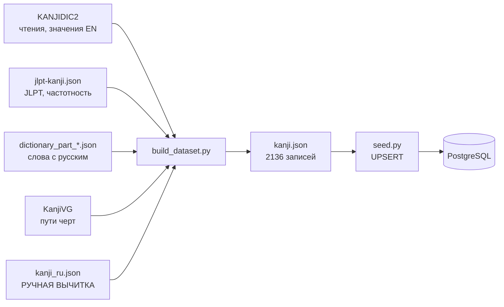

# Как собирается справочник кандзи

Документ описывает, откуда берутся данные об иероглифах, как они
превращаются в содержимое базы и что нужно сделать, чтобы добавить новый
знак в уроки.

## Коротко

В базе лежат все **2136** иероглифов дзёё, но пользователю показывается
только 81 — те, у которых русское значение выверено человеком.
Автоматика заполняет всё, что можно взять из справочников надёжно
(чтения, число черт, JLPT, частотность, пути черт), но **не заполняет
смысл**: открытого источника «кандзи → русское значение» не существует, а
выводить его косвенно оказалось опасно (см. [ниже](#почему-автовывод-ничего-не-публикует)).

## Поток данных



Внешние источники скачиваются в `backend/data/raw/` — этот каталог
в репозиторий не коммитится (десятки мегабайт).

## Два файла, которые легко перепутать

| | `kanji_ru.json` | `kanji.json` |
|---|---|---|
| Что это | **вход**, пишется руками | **выход**, генерируется |
| Размер | ~60 КБ, 81 запись | ~2,3 МБ, 2136 записей |
| Содержит | только русский текст | слияние всех источников |
| При пересборке | не трогается | **перезаписывается целиком** |

Разделение принципиальное. `build_dataset.py` делает
`OUT_FILE.write_text(...)`, то есть затирает `kanji.json` полностью.
Живи русский текст только там, следующий запуск скрипта его уничтожил
бы. `kanji_ru.json` — единственное, что переживает пересборку.

Второй довод — ревью: правку в файле вычитки видно построчно, диff
сгенерированного файла на 2,3 МБ прочитать невозможно.

`kanji.json` коммитится намеренно: так `seed` работает без сети и
детерминированно, а деплой не зависит от доступности edrdg.org и GitHub.
Цена — сгенерированный файл в истории.

## Источники

| Источник | Что даёт | Покрытие |
|---|---|---|
| [KANJIDIC2](https://www.edrdg.org/wiki/index.php/KANJIDIC_Project) | чтения он/кун, каноническое значение по-английски | 2136 из 2136 |
| [jlpt-kanji-dictionary](https://github.com/AnchorI/jlpt-kanji-dictionary) `jlpt-kanji.json` | уровень JLPT, частотность, радикал | 2136 (ровно набор дзёё) |
| тот же репозиторий, `dictionary_part_*.json` | 220 885 слов, часть с русским переводом | — |
| [KanjiVG](https://kanjivg.tagaini.net/) | пути черт в SVG | ~11 000 знаков |
| `kanji_ru.json` | значение, описание порядка черт, слова-примеры | 81 |

Русского значения **самих иероглифов** нет ни в одном источнике.
В KANJIDIC2 значения только на английском, испанском и французском;
русский есть лишь в словаре **слов**.

## Что делает `build_dataset.py`

1. Скачивает источники в `raw/` (если их там ещё нет) и разбирает.
2. Сортирует 2136 знаков по возрастанию частотности и присваивает
   `order_index` — это порядок курса: чем употребительнее знак, тем
   раньше его изучают.
3. Для каждого знака собирает надёжные поля из KANJIDIC2 и
   `jlpt-kanji.json`.
4. Пытается вывести русское значение и кладёт догадку в
   `meaning_suggested` — **не** в `meaning`.
5. Берёт `meaning`, `writing_note`, `example_words` из `kanji_ru.json`,
   если знак там есть.
6. Для знаков с выверенным значением скачивает пути черт из KanjiVG
   и пересчитывает координаты из сетки 109×109 в 0..100.
7. Проставляет флаги: `is_published = bool(meaning)`,
   `needs_review = есть догадка, но нет вычитки`.

Пути черт качаются только для публикуемых знаков — иначе это 2136
отдельных запросов ради данных, которые никто не увидит.

## Почему автовывод ничего не публикует

Значение выводится из словарных статей, где иероглиф выступает
самостоятельным словом. Статья выбирается по пересечению её английских
глосс с каноническим значением KANJIDIC, причём первое значение весит
втрое больше остальных (`score = 3 × primary + secondary`).

Даже так результат оказался негодным:

| Знак | Автовывод | Правильно |
|---|---|---|
| 山 | спекуляция; риск | гора |
| 子 | крыса, первый знак зодиака | ребёнок |
| 本 | счётный суффикс для цилиндрических предметов | книга |

Три грубых ошибки на четырнадцати самых базовых иероглифах. Причина в
том, что один кандзи — это несколько разных слов с разными чтениями
(人 как ひと «человек» и как にん — счётный суффикс), а у 子 в самом
KANJIDIC записано «child, **sign of the rat**».

Для обучающего контента это худший вид ошибки: правдоподобная и ложная.
Поэтому `meaning` заполняется **только** из файла вычитки, а догадка
остаётся в отдельном поле как черновик и наружу через API не отдаётся.

## Слова-примеры

Их тоже пришлось вычитывать руками, по двум причинам.

**Отбор оптимизировал не то.** Данных о частотности слов в источнике
нет: поле `sequence` — это идентификатор статьи, а не частота. В
качестве замены использовалась средняя частотность составляющих
иероглифов, но самые частотные — 一 и 人, поэтому наверх всплывали
一手, 一見, 一時, 一花 вместо 手紙, 花見, 時間.

**Битые переводы.** Первый элемент русской глоссы иногда оказывается
номером или пометкой регистра, и на выходе получалось «1» или «(кн.)»
вместо смысла.

Автоматический отбор остался как запасной вариант для невычитанных
знаков, но в уроки они всё равно не попадают.

## Что делает `seed.py`

Заливает `kanji.json` в базу. Три особенности:

**Только UPSERT, никаких удалений.** У `reviews.kanji_id` внешний ключ с
`ON DELETE CASCADE`: пересоздание строк справочника молча стёрло бы весь
прогресс пользователей. Это самая дорогая ошибка из возможных здесь.

**Обход конфликта по `order_index`.** Поле уникально, и при
переупорядочивании курса обновление построчно упёрлось бы в ограничение
на полпути. Перед заливкой существующие индексы временно уводятся в
отрицательную область, а проверка ограничений откладывается до конца
транзакции.

**Инвалидация кэша.** После заливки инкрементится ключ версии в Redis —
все закэшированные выдачи справочника обесцениваются разом, без `KEYS`
по маске, которая заблокировала бы Redis целиком.

## Как добавить кандзи в уроки

1. Найти знак в `backend/data/kanji.json` и посмотреть `meaning_en`
   (каноническое значение) и `meaning_suggested` (черновик автовывода —
   **сверять, а не доверять**).
2. Добавить запись в `backend/data/kanji_ru.json`:

```json
{
  "character": "手",
  "meaning": "рука",
  "kun_reading_romaji": "te",
  "on_reading_romaji": "shu",
  "writing_note": "Четыре черты. Сначала короткая откидная влево, потом две горизонтали, в конце — вертикаль с крючком через них.",
  "example_words": [
    { "word": "手紙", "kana": "てがみ", "romaji": "tegami", "translation": "письмо" },
    { "word": "上手", "kana": "じょうず", "romaji": "jouzu", "translation": "умелый" }
  ]
}
```

3. Пересобрать и залить:

```bash
docker compose -f docker-compose.yml -f docker-compose.dev.yml run --rm backend \
  python -m scripts.build_dataset --with-strokes
docker compose build backend
docker compose run --rm backend python -m scripts.seed
```

`docker compose build` между шагами обязателен: `seed` читает
`kanji.json` из образа, а пересобранный файл лежит на хосте. Без этого
зальётся старая версия — грабли, на которые легко наступить дважды.

Обязательное поле ровно одно — `meaning`; именно оно включает
`is_published`. Остальные желательны: без `writing_note` последний экран
урока остаётся без пояснения.

## Текущее состояние

| | Кандзи |
|---|---|
| Всего в базе | 2136 |
| Опубликовано (вычитано) | 81 — весь N5 плюс один знак N4 |
| Есть догадка, ждут вычитки | 1054 |
| Нет даже догадки | 1001 |

При темпе «один знак в день» 81 знак — это около трёх месяцев уроков.

## Известные пробелы

**Пояснения к отдельным чертам пустые.** Поле `instruction` у каждого
элемента `strokes` не заполняется: подписи были в старых статических
данных фронтенда и не перенеслись в конвейер. Под миниатюрой черты
показывается только её номер. Общее описание (`writing_note`) есть у
всех опубликованных.

**Ромадзи чтений — только у вычитанных.** KANJIDIC2 даёт кану, но не
латиницу, поэтому `kun_reading_romaji` и `on_reading_romaji` берутся
исключительно из файла вычитки.

**Тысяча знаков без русского значения** не имеет автоматического пути к
публикации. Вариант ускорить — перевести английские значения KANJIDIC
силами модели: они короткие и переводятся надёжно, в отличие от
косвенного вывода из словаря слов.
